# Bob's Corn - Rate Limiter App

## 1. Video Link

* https://jam.dev/c/e26d96a9-2706-4c8a-80d8-bb076c64fd6e

## 2. Overview

Bob’s Corn is a full-stack application that enforces a business rule:

**A client can only buy 1 corn per minute**

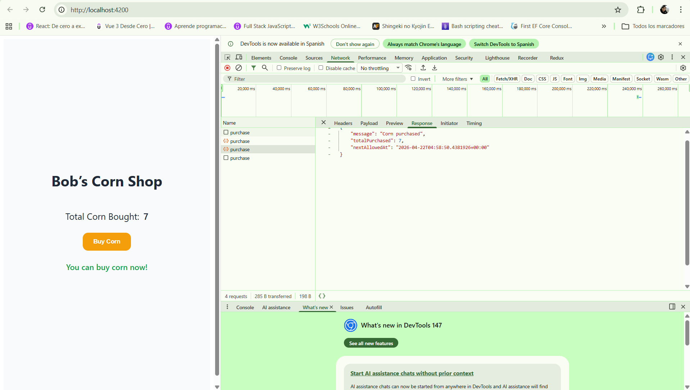
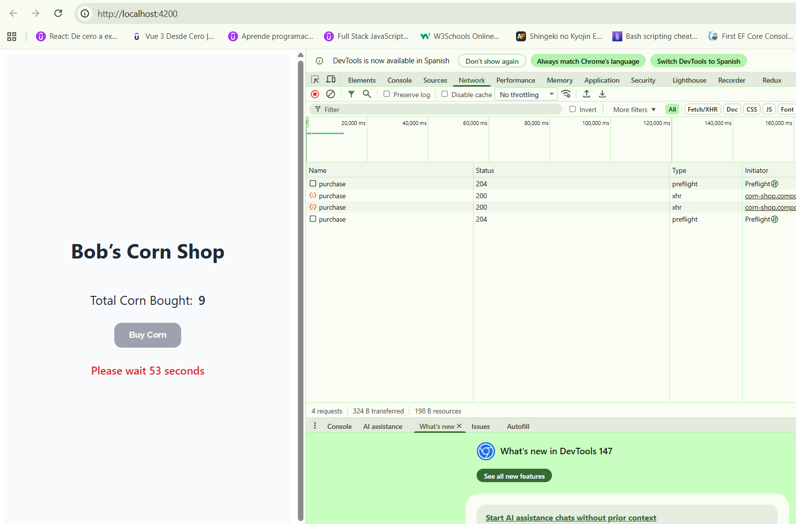
---

---
## 3. Concurrent Problem For the Same Client

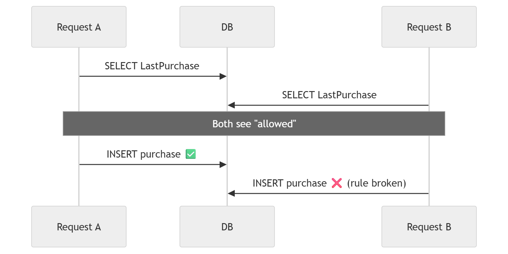

## 4. Architecture

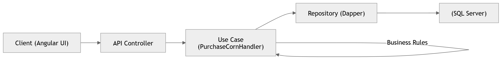

### 3.a Backend

* Clean Architecture (Application, Domain, Infrastructure, API)
* Dapper for data access
* SQL Server for persistence

### 3.b Frontend

* Angular (standalone components)
* Reactive UI with cooldown timer

## 5. Solution

### 5.a transaction locking

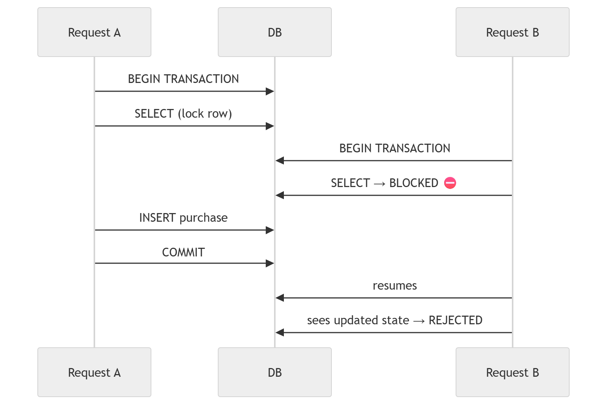

### 5.b serializable isolation

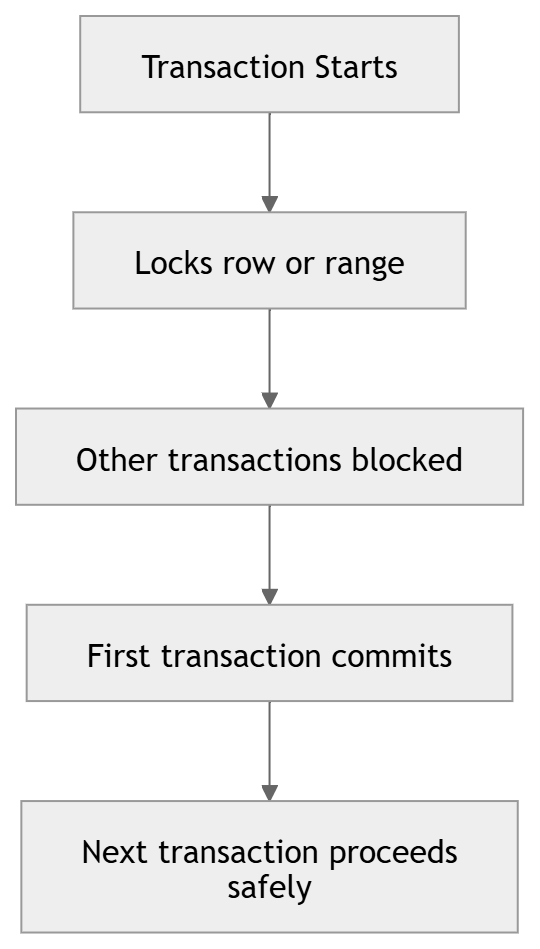

### 5.c deadlock scenario

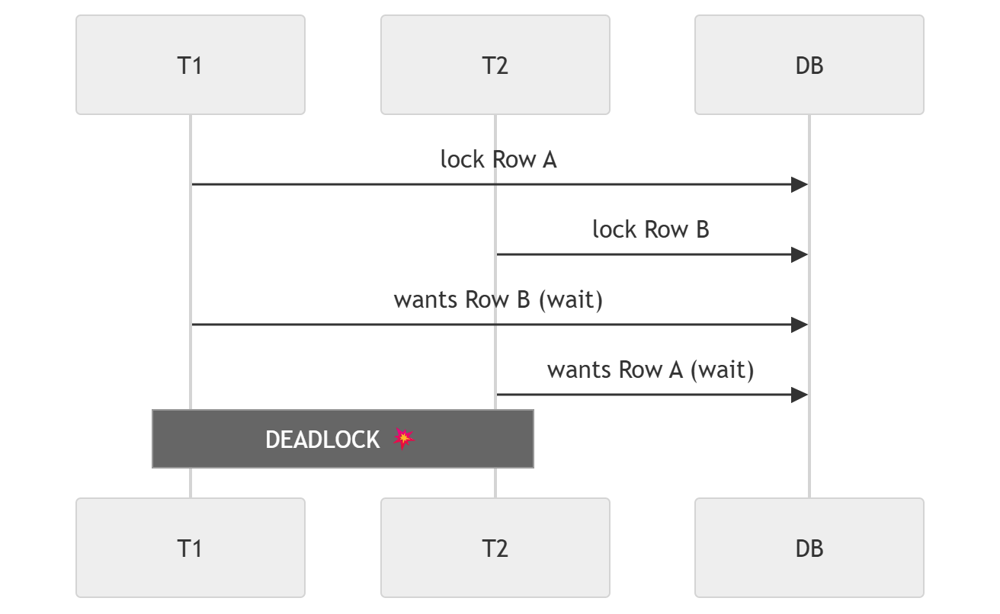

### 5.d retry strategy

Deadlocks are expected in high concurrency systems, so we handle them with retries currency tests

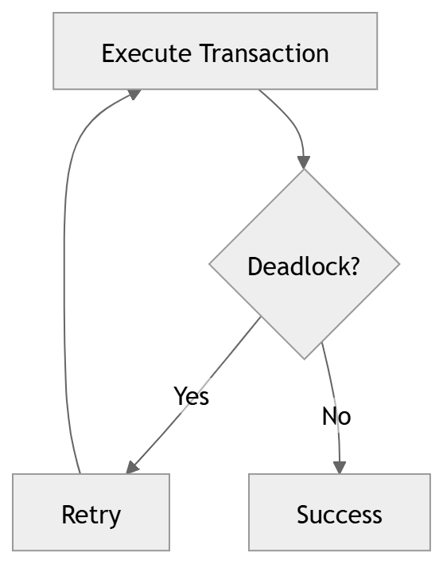

### 5.e concurrency test 

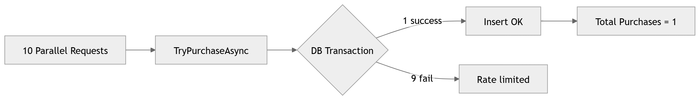

## 6. Features

* Rate limiting per client
* Cooldown feedback (frontend)
* Retry-After header support
* Purchase history tracking

---

## 7. Testing

* Unit tests with xUnit and Moq
* Controller tests (HTTP behavior)
* Edge cases covered (rate limit, headers)
* Integration tests for test concurrency
---

## 8. How to Run

### 8.a Backend

requirements:
* SDK .NET 8

```bash
cd BobCorn.API
dotnet run
```

### 8.b Frontend

requirements:

* Angular CLI: 19.2.13
* Node: 24.11.1
* Package Manager: bun 1.2.9

```bash
cd bob-corn-web-app
npm install
npm run start
```

---

## 9. Database (SQL Server)

Create database:

```sql
CREATE DATABASE BobCorn;
```

Create tables:

```sql
CREATE TABLE CornPurchases (
    Id UNIQUEIDENTIFIER PRIMARY KEY,
    ClientId NVARCHAR(100) NOT NULL,
    PurchasedAt DATETIMEOFFSET NOT NULL
);

CREATE INDEX IX_CornPurchases_ClientId_PurchasedAt
ON CornPurchases (ClientId, PurchasedAt DESC);

CREATE TABLE ClientPurchaseState (
    ClientId NVARCHAR(100) PRIMARY KEY,
    LastPurchaseAt DATETIMEOFFSET NOT NULL
);
```

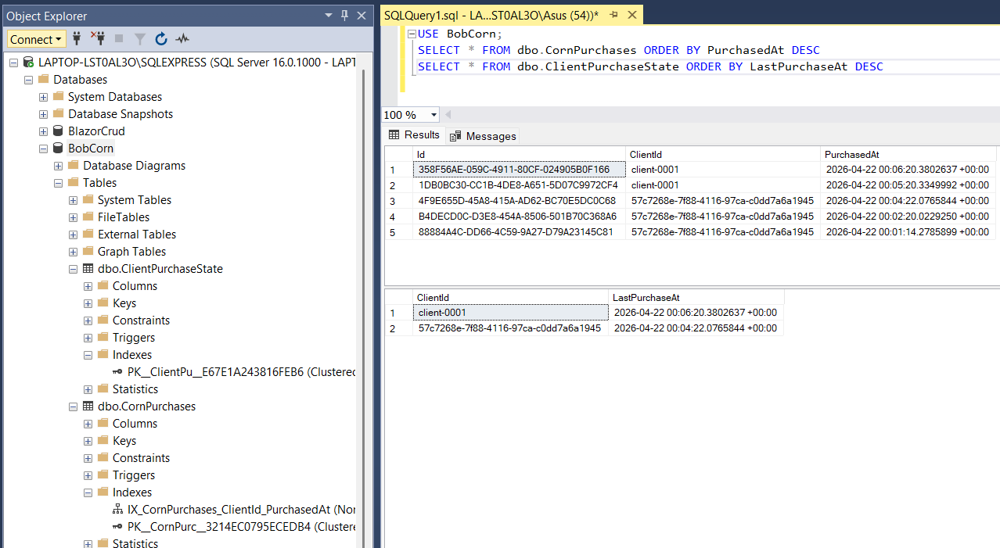

---

## 10. Postman Collection Requests
---

Postman 200 OK

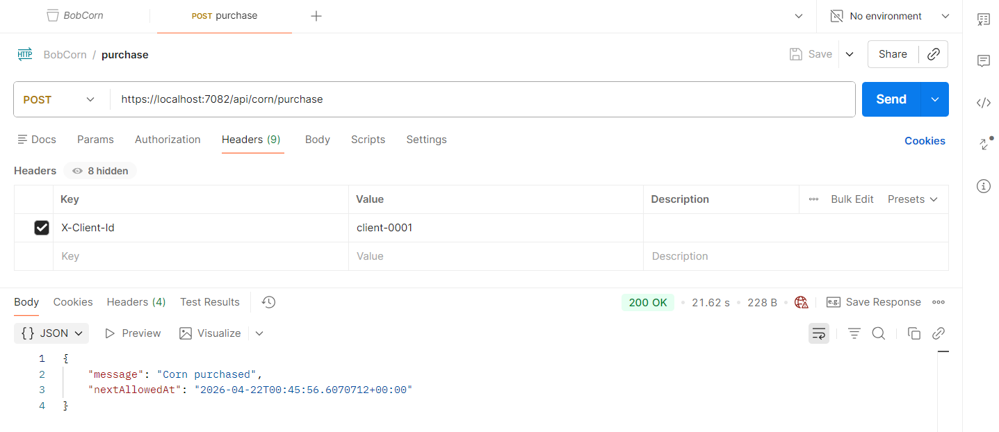

Postman 429 Too Many Requests

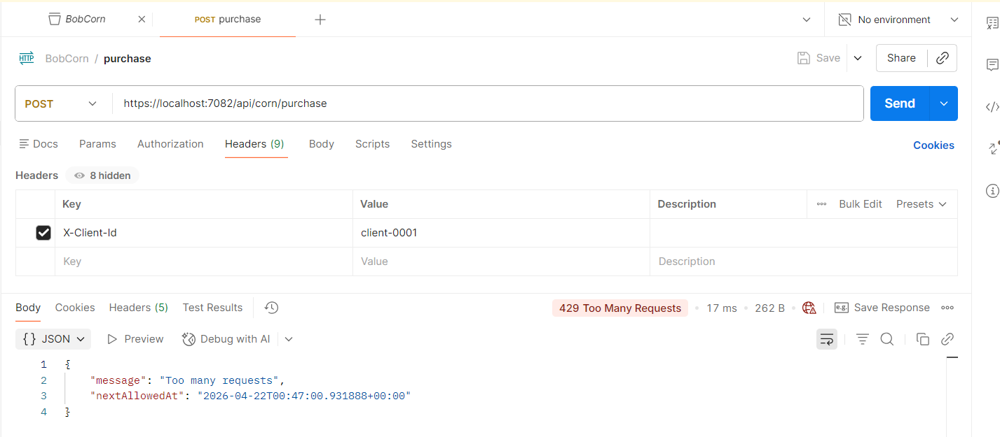

---

## 11. Design Decisions

* Separate read model (`ClientPurchaseState`) for performance
* Use Dapper for lightweight data access
* Frontend handles UX, backend enforces rules
* Clean separation of concerns

## 12. Unit Testing And Integration Testing 

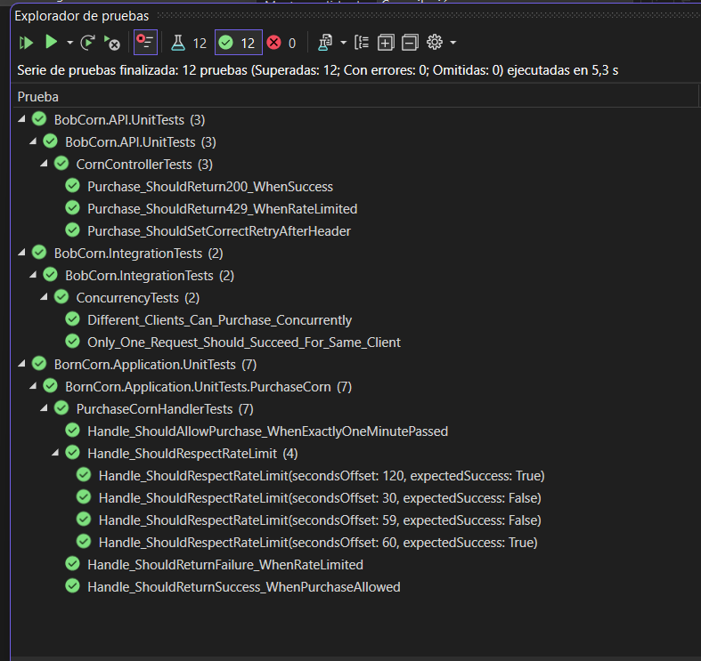

---

## 13. Code Challenge Reference:

- https://coda.io/d/Shared-Software-Engineer-Challenge_dyBwZvKLrdE/Challenge-Software-Engineer_suydMA8O#_luFSdSnr
